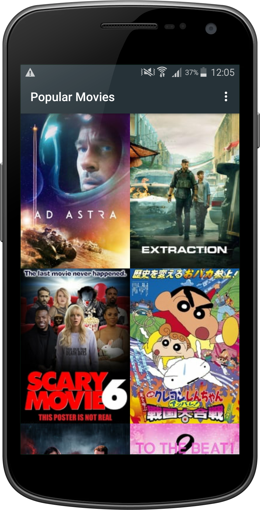
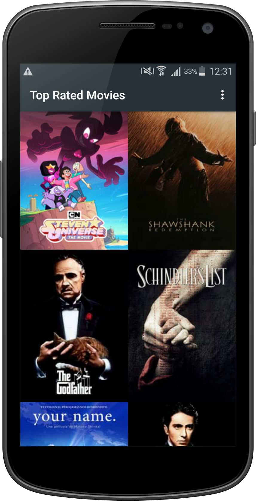
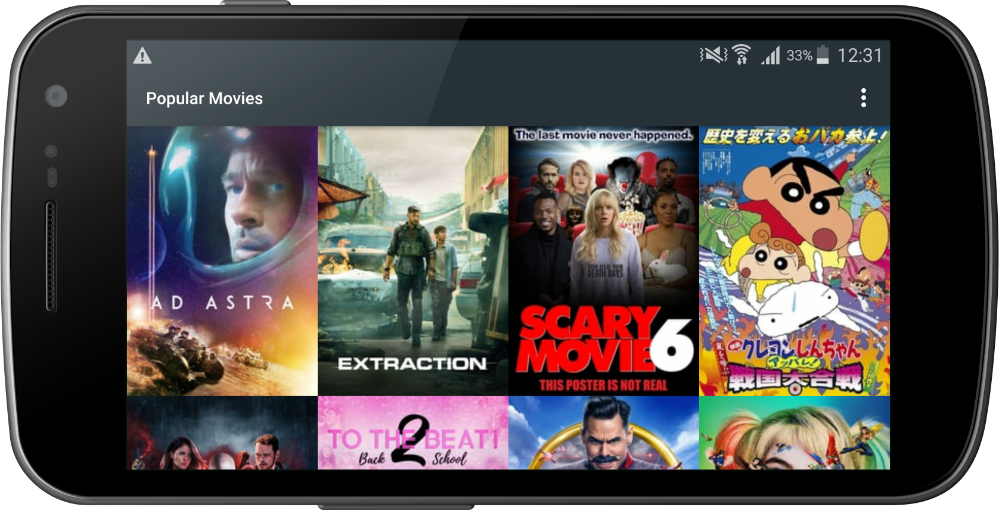
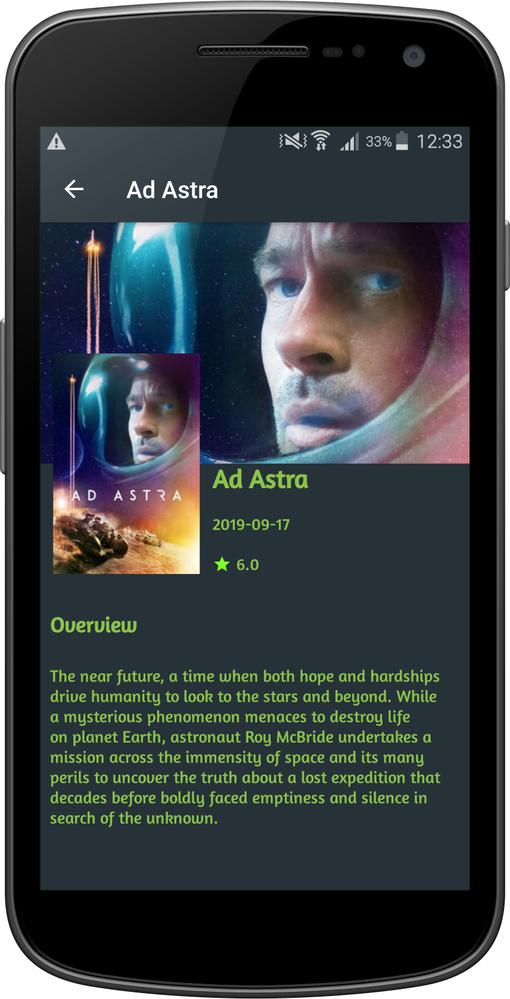

# Popular-Movies
This product uses the TMDb API but is not endorsed or certified by TMDb.

This is the second project in Udacity Android Nanodegree course purely for educational purposes

Stage 1:  Main Discovery Screen, A Details View, and Settings
* Build a UI layout for multiple Activities.
* Launch these Activities via Intent.
* Fetch data from themovieDB API

User Experience
In this stage you’ll build the core experience of your movies app.

Your app will:
- Upon launch, present the user with an grid arrangement of movie posters.
- Allow your user to change sort order via a setting:
  - The sort order can be by most popular, or by top rated
- Allow the user to tap on a movie poster and transition to a details screen with additional information such as:
  - original title
  - movie poster image thumbnail
  - A plot synopsis (called overview in the api)
  - user rating (called vote_average in the api)
  - release date

Specifications:
* App is written solely in the Java Programming Language.

* Movies are displayed in the main layout via a grid of their corresponding movie poster thumbnails.

* UI contains an element (i.e a spinner or settings menu) to toggle the sort order of the movies by: m**ost popular, highest rated.

* UI contains a screen for displaying the details for a selected movie.

* Movie details layout contains title, release date, movie poster, vote average, and plot synopsis.

* App utilizes stable release versions of all libraries, Gradle, and Android Studio.

Kindly note that you will need an API Key from [TMDB.org][1]. in order to build and try this application

Add the following line to [USER_HOME]/.gradle/gradle.properties

For Windows OS, example for Denis user:

    C:\Users\Denis\.gradle
    
find the gradle.properties file and write in it :

**myTMDBApiKey="<_YOUR-API-KEY_>"** 

[1]:https://developers.themoviedb.org/3/getting-started/introduction

    

    
