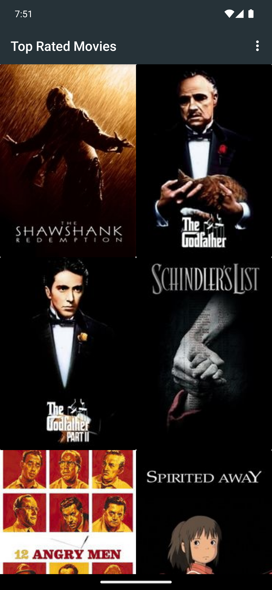
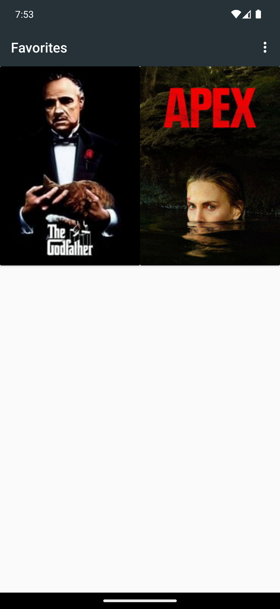
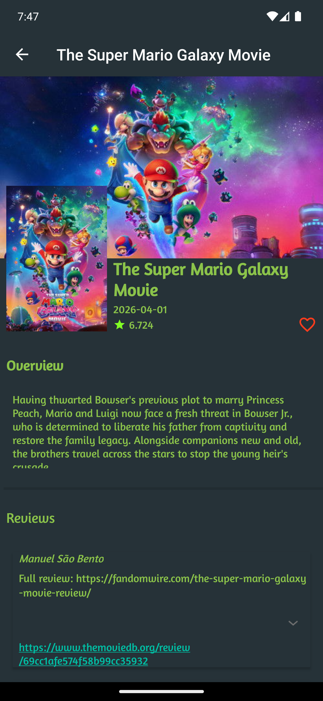
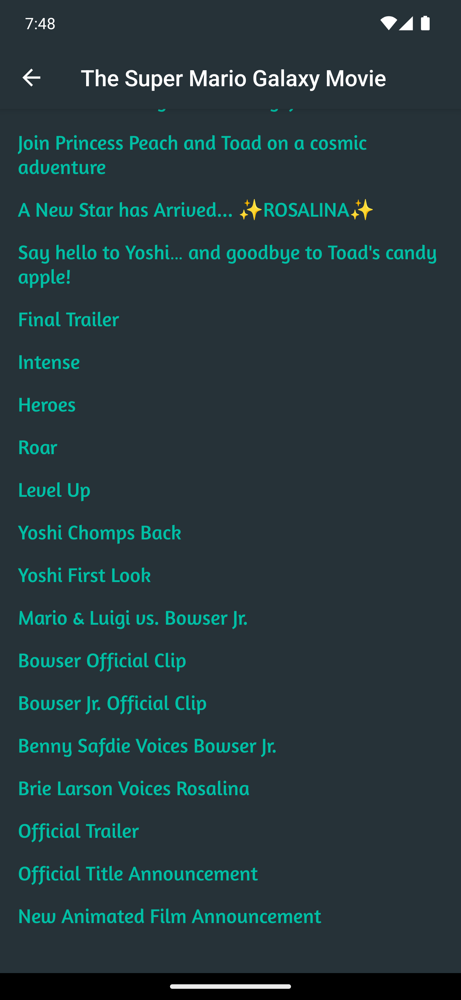
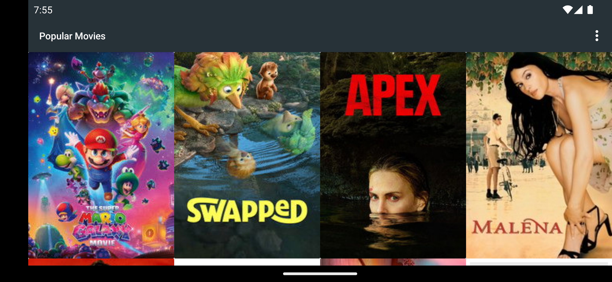
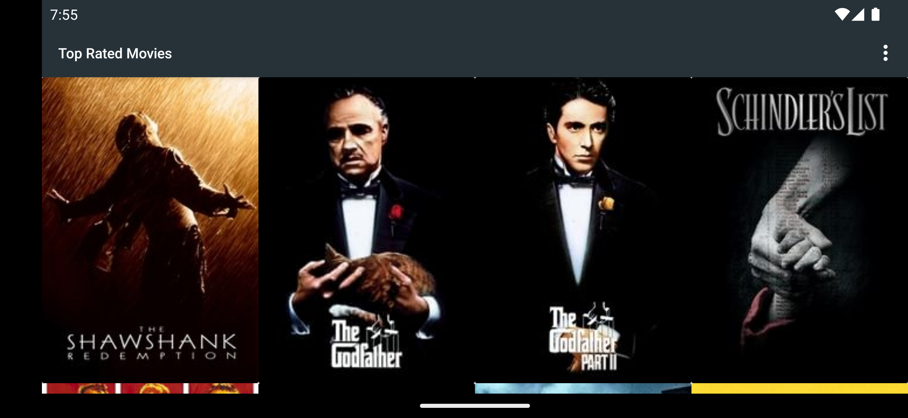
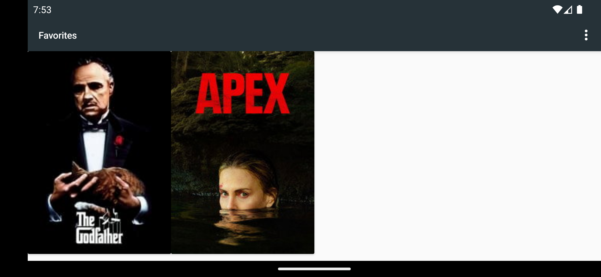
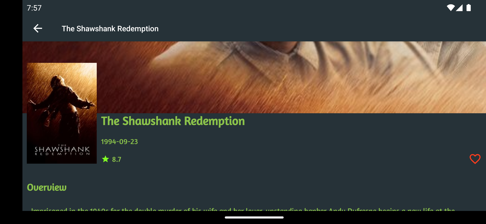

# Popular-Movies2
This product uses the TMDb API but is not endorsed or certified by TMDb.

This is the second project in Udacity Android Nanodegree course purely for educational purposes

## Stage 2: Trailers, Reviews, and Favorites

User Experience
In this stage you’ll add additional functionality to the app you built in Stage 1.

You’ll add more information to your movie details view:

Your app will:
- You’ll allow users to view and play trailers ( either in the youtube app or a web browser).
- You’ll allow users to read reviews of a selected movie.
- You’ll also allow users to mark a movie as a favorite in the details view by tapping a button(star). This is for a local movies collection that you will maintain and does not require an API request*.
- You’ll modify the existing sorting criteria for the main view to include an additional pivot to show their favorites collection.

Specifications:
* App is written solely in the Java Programming Language.

* Movies are displayed in the main layout via a grid of their corresponding movie poster thumbnails.

* UI contains an element (i.e a spinner or settings menu) to toggle the sort order of the movies by: most popular, highest rated.

* UI contains a screen for displaying the details for a selected movie.

* Movie details layout contains title, release date, movie poster, vote average, and plot synopsis.

* App utilizes stable release versions of all libraries, Gradle, and Android Studio.

> Historical note: the Udacity rubric required Java; this app was converted to Kotlin after submission and has since been brought onto a Google-recommended stack — see "Tech stack" below.

## Tech stack

The data, DI, imaging, and JSON layers all sit on the modern Android target stack. The UI layer is still XML/Activities; the Compose migration is the last big lane.

| Concern | Library / pattern |
|---|---|
| Language | Kotlin 2.2 |
| Min SDK | 26 (adaptive launcher icon, no `mipmap-*dpi/` PNG fallbacks) |
| Build | Gradle 9.4 with Kotlin DSL + `gradle/libs.versions.toml` version catalog |
| DI | Hilt 2.56 (`@HiltAndroidApp`, `@HiltViewModel`, `@AndroidEntryPoint`) |
| Async | Coroutines + Flow / StateFlow (no RxJava, no LiveData) |
| Networking | Retrofit 2.11 `suspend` + OkHttp + `converter-kotlinx-serialization` |
| JSON | kotlinx.serialization 1.7 (compile-time, no reflection) |
| Local persistence | Room 2.7 — DAO reads return `Flow`, writes are `suspend` |
| Image loading | Coil 2.7 — accessed only through a `ui.image.ImageLoader` interface |
| Connectivity | `NetworkMonitor` interface backed by `ConnectivityManager.NetworkCallback`; observed reactively from VMs |
| Coverage | Kover (≥60% line gate, enforced in CI) |
| UI (still legacy) | XML layouts + DataBinding + ViewBinding, two Activities (`MainActivity` / `DetailActivity`) — migration to Jetpack Compose + Navigation-Compose pending |

For the full set of decisions and constraints driving this stack — including the LoD-and-abstractions rule that drove the `MovieRepository` interface and the `ImageLoader` indirection — see [CLAUDE.md](./CLAUDE.md).

Kindly note that you will need an API Key from [TMDB.org][1]. in order to build and try this application

Add the following line to \[USER_HOME]/.gradle/gradle.properties

For Windows OS, example for Denis user:

    C:\Users\Denis\.gradle
    
find the gradle.properties file and write in it :

**myTMDBApiKey="<_YOUR-API-KEY_>"** 

[1]:https://developers.themoviedb.org/3/getting-started/introduction

## Screenshots

### Portrait

| Popular | Top Rated | Favorites |
| --- | --- | --- |
|  |  |  |

| Detail | Trailers |
| --- | --- |
|  |  |

### Landscape

| Popular | Top Rated |
| --- | --- |
|  |  |

| Favorites | Detail |
| --- | --- |
|  |  |